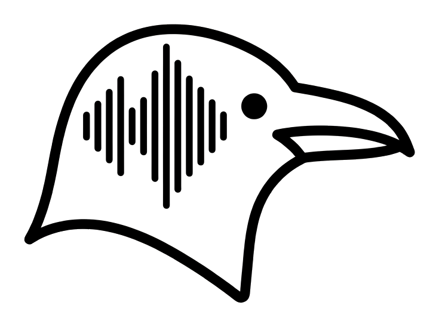
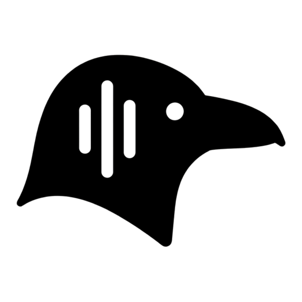

<p align="center">
  <picture>
    <source media="(prefers-color-scheme: dark)" srcset="logos/full_logo_dark.png"/>
    
  </picture>
</p>

<h1 align="center">bird_brain</h1>

<p align="center"><em>A little bird told me.</em></p>

<p align="center">
  <a href="LICENSE"></a>
  <a href="https://www.python.org/"></a>
  
  
  <a href="https://github.com/kleer001/bird_brain/commits/main"></a>
  <a href="https://github.com/kleer001/bird_brain/issues"></a>
  <a href="https://github.com/kleer001/bird_brain/stargazers"></a>
</p>

<p align="center">
  <strong>Hears both sides</strong> &middot; <strong>Speaks only on your keypress</strong> &middot; <strong>Runs on your Claude subscription</strong>
</p>

---

A voice copilot for Linux that listens to **both sides** of a spoken conversation — your mic and whatever is coming out of your speakers — keeps a rolling speaker-tagged transcript, and hands it to Claude **only when you press a key**. No turn-taking classifier, no guessing when to speak. You decide.

It has two lanes on two hotkeys, because "what do I say right now" and "is that actually true" are different questions with different deadlines.

- **Fast lane** — the reflex answer. Haiku, no tools, one turn, streaming. For "give me something to say."
- **Deep lane** — Claude Code in the conversation. A persistent Agent SDK session with real tools that searches, reads, and reports back with sources. For "go check that."
- **No API key required.** Both lanes run on the Claude Code credential you already have. Nothing bills per token.

## Get Started

**Prerequisites:** Ubuntu 22.04+ (or any PipeWire desktop), Python 3.10+, and the Claude Code CLI.

```bash
git clone https://github.com/kleer001/bird_brain && cd bird_brain
python3 -m venv .venv && .venv/bin/pip install -r requirements.txt
npm install -g @anthropic-ai/claude-code && claude login
cp .env.example .env
./run.sh --check      # preflight: devices, signal levels, STT, both lanes, trigger
./run.sh              # then press your bound keys
```

`./run.sh --check` measures rather than assumes — it plays a tone out your speakers and listens on the monitor to prove the capture path works end to end, records six seconds of your voice and transcribes it back, and round-trips a token through the real trigger FIFO. It stops at the first failure the later checks depend on, so the output names one component instead of cascading.

Full setup, including binding the hotkeys: **[INSTALL.md](INSTALL.md)**.

## How it works

```
  mic ────┐                                  ┌── Meta+Space ──▶ FAST lane ──▶ streamed answer
          ├──▶ STT ──▶ rolling transcript ───┤    (Haiku, no tools, one turn)
monitor ──┘        (speaker-tagged, in RAM)  └── Meta+D ──────▶ DEEP lane ──▶ researched answer
                                                  (Agent SDK session, tools on)
```

Both lanes read the same transcript window; they differ in what they're allowed to do with it. The deep lane can search the web, read files, and grep the codebase. Its shell access is gated behind an explicit `y/N` prompt, because the transcript contains the *other* party's speech — a command here can be shaped by input you don't control.

| | Fast lane | Deep lane |
|---|---|---|
| Trigger | `Meta+Space` | `Meta+D` |
| Model | Haiku 4.5 | your Claude Code default |
| Tools | none | read, grep, glob, web search, web fetch |
| Shell | — | gated on `y/N` |
| Measured latency | 3–16s to first word | 4s with nothing to check, 22s with a real search |
| Billing | subscription | subscription |

A press while that lane is still working is **dropped, not queued**. Mid-conversation, a stale answer arriving late is worse than none.

## Why native, and not a browser extension

System-audio capture in the browser is a dead end on Linux:

| | Firefox | Chrome (Linux) |
|---|---|---|
| System audio via `getDisplayMedia` | ignored silently ([Bug 1541425](https://bugzilla.mozilla.org/show_bug.cgi?id=1541425)) | not supported on Linux ([explainer](https://github.com/eladalon1983/screen-share-explainers/blob/main/systemAudio_Explainer.md)) |
| Tab audio | no | one shared tab only |

PipeWire exposes a `.monitor` source carrying everything you hear, from any app, with no permission prompt. The hard part on macOS and in browsers is nearly free here — and it's **app-agnostic**: it makes no difference whether the call is in Firefox, Chrome, or a native Zoom or Teams client.

## Speech to text

Local by default: `faster-whisper` on your own GPU, no key, nothing leaving the machine. One model is shared by both capture pipelines and loads alongside capture rather than ahead of it, so the opening seconds of a conversation aren't lost to a cold start.

`vad_filter` stays on and is not a tuning knob — fed a silent window, Whisper reliably invents dialogue, and that fabrication lands in the transcript both lanes read as though someone said it.

Deepgram is supported as a cloud alternative (`STT_BACKEND=deepgram`), and startup refuses that combination without a key rather than failing on the first audio chunk.

## The background file

The fast lane answers from `background.txt` — not a résumé, but a stance on judging claims and giving answers. Triage by whether the truth moves. Primary evidence over commentary. One source citing another is one source. Name the base rate. Follow the incentive. Say plainly what isn't known.

It ships with worked exchanges in the transcript's own speaker format, and it shows. Told *"everyone's moved off that library, it's basically dead — should we rewrite?"*, the lane answers:

> Before you rewrite, verify the claim. Download trends and commit history are both public — if the library is dead, those will show it clearly. "Everyone moved off" is usually commentary, not evidence, and rewriting is expensive enough that it deserves to rest on something more solid than the vibe.

Point `BIRD_BRAIN_RESUME` at your own file to replace it.

## Docs

| File | What |
|---|---|
| **[INSTALL.md](INSTALL.md)** | PipeWire, hotkey binding, Python env, credentials |
| **[MVP_TEST.md](MVP_TEST.md)** | The live run-through — the judgment calls a script can't make |
| **[SPEC.md](SPEC.md)** | Component design, data shapes, latency budget, deferred work |
| `selftest.py` | The automated preflight checks behind `./run.sh --check` |
| `background.txt` | What the fast lane answers from |

## Status

Verified working, on real hardware:

- **Both capture paths.** Mic and monitor, measured by signal level rather than byte count — a dead device streams zeros forever and looks identical to a live one otherwise.
- **Speaker-tagged transcription.** Real speech through the monitor transcribes correctly and lands tagged as the far side.
- **Deep lane.** Researched a spoken question with real tools and reported back naming what it checked. Its shell gate denies safely.
- **Fast lane.** Answers from the background file on the subscription credential, streaming.
- **Hotkeys.** Bound and round-tripped through the trigger FIFO.

Honest about what isn't there yet: fast-lane latency is **3–16 seconds and variable**, against a design target of about one second — the Agent SDK's CLI hop is the floor, and the cause of the spread is not yet diagnosed. Answers also run longer than the two-to-four-sentence instruction asks for. Terminal output only: no overlay window, no text-to-speech, no screen-share hiding. `SPEC.md` §6 lists what's deliberately deferred.

## Prior art

If you'd rather fork than start clean — both ship an overlay and local transcription already, and you'd swap in the Claude lanes:

- [Natively](https://github.com/Natively-AI-assistant/natively-cluely-ai-assistant) — overlay, real-time transcription, stealth mode, local RAG, BYOK. Check the license: advertised free for personal and non-commercial use, which is **not** permissive.
- [Meetily](https://openalternative.co/meetily) — MIT, fully local, no meeting bot.

The interaction model is modeled on [Parakeet AI](https://www.parakeet-ai.com/) — transcribe continuously, answer on a hotkey — built native instead of in a browser, with the second research lane added.

<p align="center">
  <picture>
    <source media="(prefers-color-scheme: dark)" srcset="logos/bb_icon_dark.png"/>
    
  </picture>
</p>

<p align="center">
  <sub>MIT licensed. Runs on your machine, on your credential, and only speaks when you ask it to.</sub>
</p>
