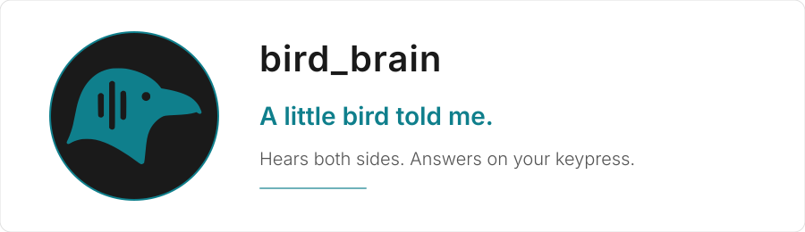

<p align="center">
  <picture>
    <source media="(prefers-color-scheme: dark)" srcset="logos/banner_dark.svg"/>
    
  </picture>
</p>

<p align="center">
  <a href="LICENSE"></a>
  <a href="https://www.python.org/"></a>
  
  
  <a href="https://github.com/kleer001/bird_brain/commits/main"></a>
  <a href="https://github.com/kleer001/bird_brain/issues"></a>
  <a href="https://github.com/kleer001/bird_brain/stargazers"></a>
</p>

<p align="center">
  <strong>Speech-to-text stays on your machine</strong> &middot; <strong>Works with any call app</strong> &middot; <strong>No API key, no per-token billing</strong>
</p>

---

A **terminal** voice copilot for Linux. It listens to both sides of a spoken conversation — your mic and whatever is coming out of your speakers — keeps a rolling speaker-tagged transcript, and hands it to Claude **only when you press a key**. No turn-taking classifier, no guessing when to speak. You decide.

You run it in a terminal and watch it work there. The transcript scrolls past as people talk, tagged `[me]` and `[them]`, and the answer streams into the same window. There is no overlay, no second app, nothing to alt-tab to — one window you keep in the corner of the screen.

It has two lanes on two hotkeys, because "what do I say right now" and "is that actually true" are different questions with different deadlines.

- **Fast lane** — the reflex answer. Haiku, no tools, one turn, streaming. For "give me something to say."
- **Deep lane** — Claude Code in the conversation. A persistent Agent SDK session with real tools that searches, reads, and reports back with sources. For "go check that."
- **No API key required.** Both lanes run on the Claude Code credential you already have. Nothing bills per token.

## Get Started

**Prerequisites:** Ubuntu 22.04+ (or any PipeWire desktop), Python 3.10+, and the Claude Code CLI.

```bash
git clone https://github.com/kleer001/bird_brain && cd bird_brain
python3 -m venv .venv && .venv/bin/pip install -r requirements.txt
npm install -g @anthropic-ai/claude-code && claude login
cp .env.example .env
./run.sh --check      # preflight: devices, signal levels, STT, both lanes, trigger
./run.sh              # then press your bound keys
```

`./run.sh --check` measures rather than assumes — it plays a tone out your speakers and listens on the monitor to prove the capture path works end to end, records six seconds of your voice and transcribes it back, and round-trips a token through the real trigger FIFO. It stops at the first failure the later checks depend on, so the output names one component instead of cascading.

Full setup, including binding the hotkeys: **[docs/INSTALL.md](docs/INSTALL.md)**.

## How it works

```
  mic ────┐                                  ┌── Meta+Space ──▶ FAST lane ──┐
          ├──▶ STT ──▶ rolling transcript ───┤    (Haiku, no tools)         ├──▶ your terminal
monitor ──┘        (speaker-tagged, in RAM)  └── Meta+D ──────▶ DEEP lane ──┘
                                                  (Agent SDK, tools on)
```

Everything lands in the one terminal — transcript lines as they're finalized, then whichever lane you triggered streaming its answer below them. Both lanes read the same transcript window; they differ in what they're allowed to do with it. The deep lane can search the web, read files, and grep the codebase. Its shell access is gated behind an explicit `y/N` prompt in that same terminal, because the transcript contains the *other* party's speech — a command here can be shaped by input you don't control.

| | Fast lane | Deep lane |
|---|---|---|
| Trigger | `Meta+Space` | `Meta+D` |
| Model | Haiku 4.5 | your Claude Code default |
| Tools | none | read, grep, glob, web search, web fetch |
| Shell | — | gated on `y/N` |
| Measured latency | 3–16s to first word | 4s with nothing to check, 22s with a real search |
| Billing | subscription | subscription |

A press while that lane is still working is **dropped, not queued**. Mid-conversation, a stale answer arriving late is worse than none.

Component-level design, data shapes, and what's deliberately deferred: **[docs/SPEC.md](docs/SPEC.md)**. The live run-through for judging whether it's actually any good: **[docs/MVP_TEST.md](docs/MVP_TEST.md)**.

## Why native, and not a browser extension

System-audio capture in the browser is a dead end on Linux:

| | Firefox | Chrome (Linux) |
|---|---|---|
| System audio via `getDisplayMedia` | ignored silently ([Bug 1541425](https://bugzilla.mozilla.org/show_bug.cgi?id=1541425)) | not supported on Linux ([explainer](https://github.com/eladalon1983/screen-share-explainers/blob/main/systemAudio_Explainer.md)) |
| Tab audio | no | one shared tab only |

PipeWire exposes a `.monitor` source carrying everything you hear, from any app, with no permission prompt. The hard part on macOS and in browsers is nearly free here — and it's **app-agnostic**: it makes no difference whether the call is in Firefox, Chrome, or a native Zoom or Teams client.

## Transcription

`faster-whisper` on your own GPU by default — no key, no upload, no per-hour cost. Both capture pipelines share one model, and it loads alongside capture rather than before it, so the opening seconds of a conversation aren't lost to a cold start. Finished lines print to the terminal as they land, so you can see what Claude will be reading before you press anything.

Deepgram is there as a cloud alternative (`STT_BACKEND=deepgram`) if you want it.

## The background file

`prompts/background.txt` is the fast lane's prompt — the standing context Haiku answers from, loaded once at startup and identical on every press.

It carries a stance rather than a biography: how to judge a claim you just heard, and how to answer a question honestly. Triage by whether the truth moves. Primary evidence over commentary. Name the base rate. Say plainly what you don't know. Alongside that are worked exchanges written in the transcript's own `[them]` / `[me]` format, which set the register — spoken, answer first, short.

Point `BIRD_BRAIN_RESUME` at your own file to replace it.

## Prior art

If you'd rather fork than start clean:

- [Natively](https://github.com/Natively-AI-assistant/natively-cluely-ai-assistant) — overlay, real-time transcription, stealth mode, local RAG, BYOK. **No Linux support** — macOS and Windows only, and their README asks for maintainers to port it. Also check the license: advertised free for personal and non-commercial use, which is **not** permissive.
- [Meetily](https://openalternative.co/meetily) — MIT, fully local, no meeting bot.

The interaction model is modeled on [Parakeet AI](https://www.parakeet-ai.com/) — transcribe continuously, answer on a hotkey — built native instead of in a browser, with the second research lane added.

<p align="center">
  <picture>
    <source media="(prefers-color-scheme: dark)" srcset="logos/bb_icon_dark.png"/>
    
  </picture>
</p>

<p align="center">
  <sub>MIT licensed. Runs on your machine, on your credential, and only speaks when you ask it to.</sub>
</p>
